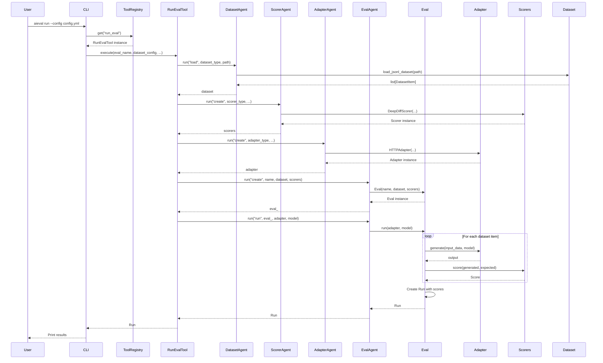

# CLI Flow: Tools → Agents → Core Components

This document explains how CLI commands flow through the architecture: **CLI → Tools → Agents → Core Components**.

**Related Documents:**
- [SDK Flow](./sdk-flow.md) - Programmatic interface flow
- [Conversational Flow](./conversational-flow.md) - Natural language interface flow
- [Architecture Document](./conversational-agent-architecture.plan.md) - Overall architecture

---

## Architecture Overview

```
User Types CLI Command
    ↓
CLI Parser (Typer)
    ↓
Tool Registry (Finds Tool)
    ↓
Tool.execute() (Wraps Agent Operations)
    ↓
Agent.run() (Orchestrates)
    ↓
Core Components (Eval, Dataset, Scorers, Adapters)
    ↓
Results Returned
```

**Key Principle:** CLI calls tools directly - no LLM, no conversational agent needed. Fast, predictable, <1 second response time.

---

## Detailed Flow: Running an Evaluation

### Example: `aieval run --config config.yml`

Let's trace through what happens when a user runs this command:

#### Step 1: CLI Entry Point

```python
# src/aieval/cli/main.py
@app.command()
def run(config: str = typer.Option(..., "--config", "-c")):
    """Run an eval from config file."""
    # CLI parses arguments
    config_dict = _load_config(config)
    
    # CLI calls tool directly (no LLM)
    from aieval.agents.tools.registry import get_tool_registry
    tool_registry = get_tool_registry()
    
    run_eval_tool = tool_registry.get("run_eval")
    result = asyncio.run(
        run_eval_tool.execute(
            eval_name=config_dict["eval"]["name"],
            dataset_config=config_dict["dataset"],
            scorers_config=config_dict["scorers"],
            adapter_config=config_dict["adapter"],
            models=config_dict.get("models", [])
        )
    )
    
    print(f"Evaluation completed: {result.run_id}")
```

**Key Point:** CLI calls tools directly - no LLM, no conversational agent needed.

---

#### Step 2: Tool Execution

```python
# src/aieval/agents/tools/eval_tools.py
class RunEvalTool(Tool):
    name = "run_eval"
    description = "Run an evaluation and get results"
    parameters_schema = {
        "type": "object",
        "properties": {
            "eval_name": {"type": "string"},
            "dataset_config": {"type": "object"},
            "scorers_config": {"type": "array"},
            "adapter_config": {"type": "object"},
            "models": {"type": "array"}
        },
        "required": ["eval_name", "dataset_config", "scorers_config", "adapter_config"]
    }
    
    def __init__(self, eval_agent: EvalAgent, dataset_agent: DatasetAgent, 
                 scorer_agent: ScorerAgent, adapter_agent: AdapterAgent):
        self.eval_agent = eval_agent
        self.dataset_agent = dataset_agent
        self.scorer_agent = scorer_agent
        self.adapter_agent = adapter_agent
    
    async def execute(
        self,
        eval_name: str,
        dataset_config: dict,
        scorers_config: list,
        adapter_config: dict,
        models: list[str] | None = None,
        **kwargs
    ) -> Run:
        # Tool orchestrates multiple agents
        # 1. Load dataset via DatasetAgent
        dataset = await self.dataset_agent.run(
            "load",
            dataset_type=dataset_config["type"],
            path=dataset_config["path"],
            filters=dataset_config.get("filters", {})
        )
        
        # 2. Create scorers via ScorerAgent
        scorers = []
        for scorer_config in scorers_config:
            scorer = await self.scorer_agent.run(
                "create",
                scorer_type=scorer_config["type"],
                **scorer_config
            )
            scorers.append(scorer)
        
        # 3. Create adapter via AdapterAgent
        adapter = await self.adapter_agent.run(
            "create",
            adapter_type=adapter_config["type"],
            **adapter_config
        )
        
        # 4. Create eval via EvalAgent
        eval_ = await self.eval_agent.run(
            "create",
            name=eval_name,
            dataset=dataset,
            scorers=scorers
        )
        
        # 5. Run eval via EvalAgent
        runs = []
        model_list = models or [None]
        for model in model_list:
            run = await self.eval_agent.run(
                "run",
                eval_=eval_,
                adapter=adapter,
                model=model,
                **kwargs
            )
            runs.append(run)
        
        return runs[0] if len(runs) == 1 else runs
```

**Key Point:** Tool wraps agent operations, providing a clean interface.

---

#### Step 3: Agent Operations

Each agent handles its domain:

**DatasetAgent:**
```python
# src/aieval/agents/dataset_agent.py
class DatasetAgent(BaseEvaluationAgent):
    async def run(self, query: str, **kwargs) -> Any:
        if query == "load":
            dataset_type = kwargs["dataset_type"]
            path = kwargs["path"]
            
            if dataset_type == "jsonl":
                from aieval.datasets.jsonl import load_jsonl_dataset
                return load_jsonl_dataset(path)
            elif dataset_type == "index_csv":
                from aieval.datasets.index_csv import load_index_csv_dataset
                return load_index_csv_dataset(
                    index_file=path,
                    filters=kwargs.get("filters", {})
                )
```

**ScorerAgent:**
```python
# src/aieval/agents/scorer_agent.py
class ScorerAgent(BaseEvaluationAgent):
    async def run(self, query: str, **kwargs) -> Any:
        if query == "create":
            scorer_type = kwargs["scorer_type"]
            
            if scorer_type == "deep_diff":
                from aieval.scorers.deep_diff import DeepDiffScorer
                return DeepDiffScorer(
                    name=kwargs.get("name", "deep_diff"),
                    eval_id=kwargs.get("eval_id", "deep_diff.v1"),
                    version=kwargs.get("version", "v3")
                )
            elif scorer_type == "llm_judge":
                from aieval.scorers.llm_judge import LLMJudgeScorer
                return LLMJudgeScorer(
                    name=kwargs.get("name", "llm_judge"),
                    model=kwargs.get("model", "gpt-4o-mini"),
                    rubric=kwargs.get("rubric")
                )
```

**EvalAgent:**
```python
# src/aieval/agents/eval_agent.py
class EvalAgent(BaseEvaluationAgent):
    async def run(self, query: str, **kwargs) -> Any:
        if query == "create":
            from aieval.core.eval import Eval
            return Eval(
                name=kwargs["name"],
                dataset=kwargs["dataset"],
                scorers=kwargs["scorers"]
            )
        
        elif query == "run":
            eval_ = kwargs["eval_"]
            adapter = kwargs["adapter"]
            model = kwargs.get("model")
            
            # EvalAgent orchestrates the actual evaluation
            return await eval_.run(
                adapter=adapter,
                model=model,
                concurrency_limit=kwargs.get("concurrency_limit", 5)
            )
```

**Key Point:** Agents encapsulate domain logic and coordinate with core components.

---

#### Step 4: Core Components

The `Eval.run()` method orchestrates the actual evaluation:

```python
# src/aieval/core/eval.py
class Eval:
    async def run(
        self,
        adapter: Adapter,
        model: str | None = None,
        concurrency_limit: int = 5
    ) -> Run:
        # 1. For each dataset item
        scores = []
        for item in self.dataset:
            # 2. Generate output via adapter
            output = await adapter.generate(
                input_data=item.input,
                model=model
            )
            
            # 3. Score via scorers
            item_scores = []
            for scorer in self.scorers:
                score = scorer.score(
                    generated=output,
                    expected=item.expected,
                    metadata=item.metadata
                )
                item_scores.append(score)
            
            scores.extend(item_scores)
        
        # 4. Create Run with scores
        return Run(
            eval_id=self.eval_id,
            run_id=Run.generate_run_id(),
            dataset_id=Run.generate_dataset_id(self.dataset),
            scores=scores,
            metadata={
                "model": model,
                "eval_name": self.name
            }
        )
```

**Key Point:** Core components do the actual work (dataset loading, scoring, etc.).

---

## Flow Diagram



---

## Using Skills in CLI

**Skills** are reusable workflows that compose multiple tools. CLI can use skills directly (no LLM needed).

### Example: Using a Skill Instead of Individual Tools

```python
# CLI can use a skill for complex workflows
@app.command()
def run_eval_skill(
    eval_name: str,
    dataset_path: str,
    scorer_types: str,  # comma-separated
):
    """Run evaluation using EvaluationSkill."""
    from aieval.agents.skills.registry import get_skill_registry
    
    skill_registry = get_skill_registry()
    evaluation_skill = skill_registry.get("evaluation")
    
    result = asyncio.run(
        evaluation_skill.execute(
            eval_name=eval_name,
            dataset_path=dataset_path,
            scorer_types=scorer_types.split(","),
            adapter_config={"type": "http", "base_url": os.getenv("API_URL")}
        )
    )
    
    print(f"Evaluation completed: {result.run_id}")
```

**Key Point:** Skills encapsulate workflows, making them reusable. CLI can use skills directly (no LLM needed).

---

## Comparison: Tools vs Skills

| Aspect | Tools | Skills |
|--------|-------|--------|
| **Purpose** | Atomic operations | Reusable workflows |
| **Example** | `load_dataset`, `create_scorer` | `evaluation` (composes multiple tools) |
| **Complexity** | Simple, single operation | Complex, multiple operations |
| **Usage** | CLI calls directly | CLI calls directly |
| **LLM Required** | No | No |

**When to use:**
- **Tools**: For individual operations (load dataset, create scorer, etc.)
- **Skills**: For complete workflows (run evaluation, compare with baseline, etc.)

---

## Complete Example: CLI Command with Tools

### Current (Before Tools System)

```python
@app.command()
def run(config: str):
    # CLI directly calls core components
    config_dict = _load_config(config)
    dataset = load_jsonl_dataset(config_dict["dataset"]["path"])
    scorers = [DeepDiffScorer(...) for _ in config_dict["scorers"]]
    adapter = HTTPAdapter(...)
    eval_ = Eval(name="my_eval", dataset=dataset, scorers=scorers)
    run = asyncio.run(eval_.run(adapter=adapter))
    print(f"Completed: {run.run_id}")
```

**Problem:** CLI has direct dependencies on core components, hard to test, hard to reuse.

### Proposed (With Tools System)

```python
@app.command()
def run(config: str):
    # CLI calls tool (clean interface)
    config_dict = _load_config(config)
    
    tool_registry = get_tool_registry()
    run_eval_tool = tool_registry.get("run_eval")
    
    result = asyncio.run(
        run_eval_tool.execute(
            eval_name=config_dict["eval"]["name"],
            dataset_config=config_dict["dataset"],
            scorers_config=config_dict["scorers"],
            adapter_config=config_dict["adapter"]
        )
    )
    
    print(f"Completed: {result.run_id}")
```

**Benefits:**
- Clean separation: CLI doesn't know about core components
- Testable: Mock tools in tests
- Reusable: Same tools used by SDK, API, conversational agent
- Consistent: All interfaces behave the same way

---

## Summary

1. **CLI** → Parses arguments, calls tools directly (no LLM)
2. **Tools** → Wrap agent operations, provide clean interface
3. **Agents** → Orchestrate domain logic (dataset, scorer, eval, adapter)
4. **Core Components** → Do actual work (load data, score, generate output)
5. **Skills** → Optional workflows that compose multiple tools

**Key Principles:**
- CLI calls tools directly (fast, predictable, no LLM)
- Tools are the foundation (used by all interfaces)
- Agents encapsulate domain logic
- Skills are optional workflows
- Same tools used by SDK and API (consistent behavior)
