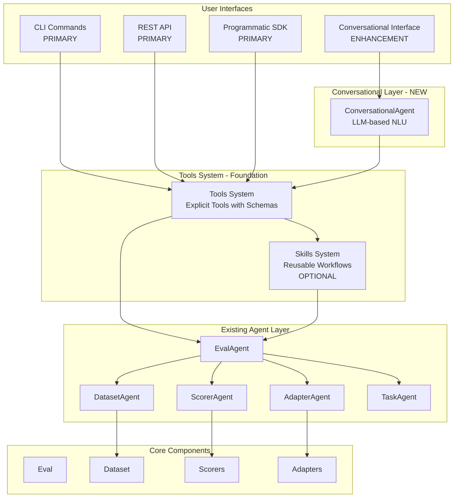

# Conversational Agent Architecture - Agent-First Pattern

**Status:** For team review

**Date:** February 2025

**Goal:** Add conversational interface as enhancement, keeping CLI/SDK as primary interfaces. Tools system is the foundation that all interfaces use.

---

## Executive Summary

This document proposes adding a **conversational interface** as an enhancement to `ai-evaluation`. CLI/SDK remain the primary interfaces, with conversational interface as an optional feature for natural language interaction. All interfaces (CLI, SDK, API, Conversational) use the same tools system foundation.

**Key Principles:**

- **CLI/SDK first**: Structured interfaces remain primary for predictable, fast workflows
- **Conversational enhancement**: Natural language interface for exploratory and learning use cases
- **Tools foundation**: Tools system is the foundation that all interfaces use
- **Extensibility**: Users can supply custom agents, skills, and tools
- **Simplicity**: Start minimal, add complexity only when needed
- **Breaking changes allowed**: Can refactor existing interfaces if it simplifies architecture

---

## Current Architecture

### Existing Components

```
User Interfaces (CLI, API, SDK)
    ↓
Agent Layer (EvalAgent, DatasetAgent, ScorerAgent, AdapterAgent, TaskAgent)
    ↓
Core Components (Eval, Dataset, Scorers, Adapters, Sinks)
```

**Current Extensibility:**

- Custom Scorers: Implement `Scorer` interface
- Custom Adapters: Implement `Adapter` interface
- Custom Sinks: Implement `Sink` interface
- Custom Datasets: Use `FunctionDataset` or add loader

**Current Limitations:**

- Users must use structured commands/configs
- No natural language interface
- No reusable workflow abstractions (skills)
- No explicit tool system for LLM function calling

---

## Proposed Architecture

### High-Level View



### User Experience

**Before (Current):**

```bash
# CLI
aieval run --config config.yml

# API
POST /experiments {"experiment_name": "my_eval", "config": {...}}

# SDK
agent.evaluate(eval_name="my_eval", dataset_config={...}, ...)
```

**After (With Tools System + Conversational Enhancement):**

```bash
# CLI/SDK remain primary (structured, fast)
aieval run --config config.yml
# or
from aieval import run_tool
run_tool("run_eval", eval_name="my_eval", dataset_path="data.jsonl")

# Conversational Interface (optional, for natural language)
aieval chat "run an eval on dataset benchmarks/datasets/index.csv with deep_diff scorer"

# Or interactive mode
aieval chat
> run eval on dataset benchmarks/datasets/index.csv
> compare the last two runs
> set baseline for eval my_eval
```

---

## Core Components

### 1. Tools System (Foundation)

**Purpose:** Explicit tools with schemas that all interfaces (CLI, SDK, API, Conversational) use.

**Design:**

- Each tool has: `name`, `description`, `parameters_schema` (JSON schema)
- Tools wrap existing agent operations
- Tools are registered in a registry
- All interfaces (CLI, SDK, API, Conversational) use the same tools

**Benefits:**

- Single source of truth for operations
- Consistent behavior across all interfaces
- CLI/SDK can call tools directly (no LLM needed)
- Conversational agent uses tools via LLM function calling

### 2. ConversationalAgent (Enhancement)

**Purpose:** Optional agent that understands natural language and orchestrates evaluation workflows using tools.

**Design:**

- Uses LLM (via LiteLLM) for natural language understanding
- Leverages LLM function calling (tools) for action execution
- Generates natural language responses
- Optional: Users can use CLI/SDK directly without LLM

**Key Methods:**

```python
class ConversationalAgent(BaseEvaluationAgent):
    async def chat(self, user_input: str, context: dict | None = None) -> str:
        """Process natural language input and return natural language response."""
        # 1. LLM parses input and selects tools
        # 2. Execute selected tools
        # 3. Generate natural language response
        pass
```

**LLM Integration:**

- Uses LiteLLM for unified routing (as per AGENTS.md)
- Primary: Anthropic Claude (complex reasoning)
- Fallback: OpenAI GPT-4o
- Configuration: Via environment variables

### 2. Tools System

**Purpose:** Explicit tools with schemas for LLM function calling.

**Design:**

- Each tool has: `name`, `description`, `parameters_schema` (JSON schema)
- Tools wrap existing agent operations
- Tools are registered in a registry
- LLM receives tool schemas and can call them

**Built-in Tools:**

1. `load_dataset` - Load dataset from JSONL or index CSV
2. `create_scorer` - Create a scorer (DeepDiff, LLM-judge, etc.)
3. `create_eval` - Create an eval definition
4. `run_eval` - Run an eval and get results
5. `compare_runs` - Compare two runs
6. `set_baseline` - Set baseline run for an eval

**Tool Interface:**

```python
class Tool(ABC):
    """Base class for tools."""
    
    name: str
    description: str
    parameters_schema: dict[str, Any]  # JSON schema
    
    @abstractmethod
    async def execute(self, **kwargs: Any) -> Any:
        """Execute the tool."""
        pass
```

**Example Tool:**

```python
class LoadDatasetTool(Tool):
    name = "load_dataset"
    description = "Load a dataset from JSONL or index CSV file"
    parameters_schema = {
        "type": "object",
        "properties": {
            "dataset_type": {"type": "string", "enum": ["jsonl", "index_csv"]},
            "path": {"type": "string"},
            "filters": {"type": "object"}
        },
        "required": ["dataset_type", "path"]
    }
    
    async def execute(self, dataset_type: str, path: str, filters: dict | None = None) -> list[DatasetItem]:
        return await self.dataset_agent.run("load", dataset_type=dataset_type, path=path, filters=filters or {})
```

### 3. Skills System (Optional - Phase 2)

**Purpose:** Reusable workflows that encapsulate common patterns.

**Design:**

- Skills compose multiple tools/agents
- Skills can be called by conversational agent
- Skills enable complex workflows (e.g., "run evaluation with baseline comparison")

**Built-in Skills:**

1. `evaluation` - Complete evaluation workflow (load dataset, create scorers, run eval)
2. `baseline_comparison` - Compare run against baseline
3. `multi_model_evaluation` - Evaluate multiple models in parallel

**Skill Interface:**

```python
class Skill(ABC):
    """Reusable workflow skill."""
    
    name: str
    description: str
    
    @abstractmethod
    async def execute(self, **kwargs: Any) -> Any:
        """Execute the skill workflow."""
        pass
```

**Example Skill:**

```python
class EvaluationSkill(Skill):
    name = "evaluation"
    description = "Run a complete evaluation: load dataset, create scorers, run eval, return results"
    
    async def execute(self, eval_name: str, dataset_path: str, scorer_types: list[str], adapter_config: dict, **kwargs) -> Run:
        # Encapsulates full workflow
        dataset = await self.dataset_agent.run("load", path=dataset_path)
        scorers = await self.scorer_agent.run("create", types=scorer_types)
        eval_ = await self.eval_agent.run("create", name=eval_name, dataset=dataset, scorers=scorers)
        run = await self.eval_agent.run("run", eval_=eval_, adapter_config=adapter_config, **kwargs)
        return run
```

---

## Extensibility Architecture

### Core Principle

Users can supply their own **Agents**, **Skills**, and **Tools**, following the same pattern as custom **Scorers** and **Adapters**.

### Extension Points

1. **Custom Tools**: Extend `Tool` base class

   - Use case: Domain-specific operations (e.g., call external API)
   - Registration: Explicit or entry points

2. **Custom Skills**: Extend `Skill` base class

   - Use case: Reusable workflows (e.g., CI/CD evaluation)
   - Registration: Explicit or entry points

3. **Custom Agents**: Extend `BaseEvaluationAgent` (Future)

   - Use case: Domain-specific orchestration
   - Registration: Explicit or entry points

### Registration Methods

**Method 1: Explicit Registration (Programmatic)**

```python
from aieval.agents.tools.registry import get_tool_registry

tool_registry = get_tool_registry()
tool_registry.register(MyCustomTool())
```

**Method 2: Entry Points (Auto-Discovery)**

```toml
# pyproject.toml
[project.entry-points."aieval.tools"]
my_tool = "my_package.tools:MyCustomTool"

[project.entry-points."aieval.skills"]
my_skill = "my_package.skills:MyCustomSkill"
```

### Example: Custom Tool

```python
from aieval.agents.tools.base import Tool

class ExternalAPITool(Tool):
    """Tool for calling external API during evaluation."""
    
    name = "call_external_api"
    description = "Call external API to enrich evaluation data"
    parameters_schema = {
        "type": "object",
        "properties": {
            "api_endpoint": {"type": "string"},
            "payload": {"type": "object"}
        },
        "required": ["api_endpoint", "payload"]
    }
    
    async def execute(self, api_endpoint: str, payload: dict) -> dict[str, Any]:
        response = await self.api_client.post(api_endpoint, json=payload)
        return response.json()

# Register
from aieval.agents.tools.registry import get_tool_registry
get_tool_registry().register(ExternalAPITool(api_client))
```

---

## Implementation Phases

### Phase 1: MVP (Essential)

**Goal:** Tools system foundation + optional conversational interface

**Components:**

1. Tool system (base interface + 6 built-in tools)
2. Tool registry
3. CLI/SDK integration with tools (direct tool calls)
4. LiteLLM client setup (for conversational mode)
5. ConversationalAgent (LLM-based NLU) - Optional
6. CLI `chat` command - Optional

**Deliverables:**

- Tools system works independently (CLI/SDK can use tools directly)
- Users can use CLI/SDK with tools (no LLM required)
- Optional: Users can chat with the agent (if LLM configured)
- Optional: Agent understands basic commands (run eval, compare runs, etc.)

**Timeline:** 2-3 weeks

**Priority:** Tools system is essential, conversational agent is optional enhancement

### Phase 2: Enhanced (If Needed)

**Goal:** Add skills and API endpoint

**Components:**

1. Skills system (base interface + 3 built-in skills)
2. Skill registry
3. Entry point discovery
4. API `/chat` endpoint

**Deliverables:**

- Reusable workflows (skills)
- API access to conversational interface
- Auto-discovery of custom components

**Timeline:** 1-2 weeks

### Phase 3: Advanced (Future)

**Goal:** Advanced features

**Components:**

1. Subagents for parallelization
2. Context compaction
3. Custom agents support
4. Plugin directory scanning

**Timeline:** TBD

---

## Design Decisions

### 1. LLM-Based NLU (Not Separate Components)

**Decision:** Use LLM function calling for natural language understanding instead of separate intent classifier/entity extractor.

**Rationale:**

- Simpler architecture (one component vs. three)
- LLMs excel at understanding intent and extracting entities
- Function calling provides structured output
- Easier to maintain

**Trade-off:**

- Slightly higher latency (one LLM call)
- Acceptable for conversational interface

### 2. Tools First, Skills Optional

**Decision:** Implement tools in Phase 1, skills in Phase 2 (optional).

**Rationale:**

- Tools are essential for LLM function calling
- Skills can be built on top of tools
- Users can start with tools and add skills later if needed
- Reduces initial complexity

### 3. Two Registration Methods

**Decision:** Support explicit registration and entry points (not config files or plugin directory).

**Rationale:**

- Explicit registration: Simple and flexible
- Entry points: Standard Python pattern, auto-discovery
- Config files: Adds complexity, defer if needed
- Plugin directory: Adds complexity, defer if needed

### 4. Defer Subagents

**Decision:** Use `asyncio.gather` for parallel execution initially, add subagents later if needed.

**Rationale:**

- `asyncio.gather` sufficient for most use cases
- Subagents add complexity (context isolation, management)
- Can add when there's clear need

### 5. Defer Context Compaction

**Decision:** Start without context compaction, add when needed.

**Rationale:**

- Most conversations will be short
- Can add compaction when users report issues
- Reduces initial complexity

---

## Integration Points

### CLI Integration

```python
@app.command()
def chat(
    message: str | None = None,
    interactive: bool = typer.Option(True, "--interactive/--no-interactive"),
    model: str = typer.Option("claude-3-5-sonnet-20241022", "--model"),
):
    """Conversational interface for evaluation operations."""
    from aieval.agents.conversational import ConversationalAgent
    
    agent = ConversationalAgent(config={"model": model})
    
    if message:
        response = asyncio.run(agent.chat(message))
        print(response)
    else:
        # Interactive mode
        print("AI Evaluation Agent - Type 'exit' to quit\n")
        while True:
            user_input = input("> ")
            if user_input.lower() in ["exit", "quit"]:
                break
            response = asyncio.run(agent.chat(user_input))
            print(f"\n{response}\n")
```

### API Integration (Phase 2)

```python
@router.post("/chat", response_model=ChatResponse)
async def chat(request: ChatRequest):
    """Conversational interface endpoint."""
    agent = ConversationalAgent(config=request.config or {})
    response = await agent.chat(request.message, context=request.context)
    return ChatResponse(message=response, session_id=request.session_id)
```

---

## Migration Strategy

**Breaking Changes Allowed:** We can refactor existing interfaces if it simplifies the architecture.

**Benefits of Breaking Changes:**

1. **Simplified Architecture**: All interfaces (CLI, API, SDK) can use `ConversationalAgent` internally

   - Single source of truth for evaluation logic
   - Consistent behavior across all interfaces
   - Easier to maintain and extend

2. **Cleaner Code**: Remove duplicate logic between interfaces

   - CLI, API, and SDK currently have separate implementations
   - Can consolidate into conversational agent layer
   - Reduces code duplication

3. **Better UX**: Unified experience across all interfaces

   - Same natural language understanding everywhere
   - Consistent error handling
   - Better extensibility

**Potential Refactorings:**

1. **CLI Refactoring**: CLI commands use tools system directly

   - CLI calls tools directly (no LLM needed)
   - Breaking: CLI command signatures might change
   - Benefit: Simpler CLI code, consistent with tools system

2. **API Refactoring**: API endpoints use tools system directly

   - API calls tools directly (no LLM needed)
   - Breaking: API request/response formats might change
   - Benefit: Unified interface layer via tools

3. **SDK Refactoring**: SDK methods use tools system directly

   - SDK calls tools directly (no LLM needed)
   - Breaking: SDK method signatures might change
   - Benefit: Consistent behavior via tools system

**Note:** Conversational agent is separate enhancement - CLI/SDK/API don't need to use it

**Migration Path:**

- Document all breaking changes in CHANGELOG
- Provide migration guide for users
- Version bump to reflect breaking changes (e.g., 0.2.0 → 1.0.0)
- Deprecation period optional (can make clean break)

---

## Success Metrics

1. **Usability**: Users can complete common tasks via natural language
2. **Accuracy**: Intent understanding accuracy >90%
3. **Performance**: Response time <5 seconds for simple queries
4. **Adoption**: Users prefer conversational interface for interactive workflows
5. **Extensibility**: Users successfully create custom tools/skills

---

## Risks and Mitigations

| Risk | Impact | Mitigation |

|------|--------|------------|

| LLM costs | Medium | Use efficient models, cache responses, track usage |

| LLM latency | Medium | Use fast models (Claude Sonnet), async execution |

| Complexity | Low | Start minimal, add features incrementally |

| User confusion | Medium | Clear documentation, migration guide, examples |

---

## Open Questions

1. **Session Management**: Should conversations persist across CLI sessions?

   - **Recommendation**: Start without persistence, add if needed

2. **Error Handling**: How should the agent handle ambiguous requests?

   - **Recommendation**: Ask clarifying questions via LLM

3. **Tool Execution**: Should tools execute synchronously or asynchronously?

   - **Recommendation**: Async for better performance

4. **Skills vs Tools**: When should users create skills vs. tools?

   - **Recommendation**: Tools for atomic operations, skills for workflows

---

## References

- [AGENTS.md](../AGENTS.md) - Agent preferences and guidelines
- [Architecture Docs](../docs/architecture.md) - Current architecture
- [Custom Adapters](../docs/custom-adapters.md) - Extensibility pattern
- [Key Learnings Plan](./key_learnings_from_claude_cursor_and_openai_b1384647.plan.md) - Learnings from Claude/Cursor/OpenAI

---

## Appendix: Comparison with Current System

| Aspect | Current | Proposed |

|--------|---------|----------|

| **Interface** | CLI/API/SDK (structured) | + Conversational (natural language) |

| **Extensibility** | Scorers, Adapters, Sinks | + Tools, Skills, Agents |

| **NLU** | N/A | LLM-based (function calling) |

| **Workflows** | Ad-hoc (SDK calls) | + Skills (reusable) |

| **Complexity** | Low | Medium (but incremental) |