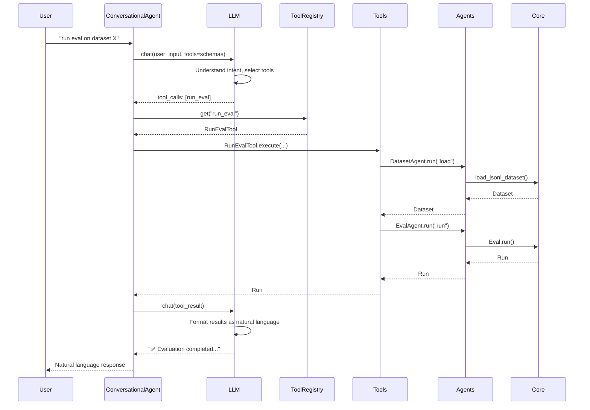

# Conversational Flow: Natural Language Interface

This document explains how the conversational interface flows through the architecture: **User Input → ConversationalAgent → LLM → Tools → Agents → Core Components**.

**Related Documents:**
- [CLI Flow](./cli-flow.md) - Command-line interface flow
- [SDK Flow](./sdk-flow.md) - Programmatic interface flow
- [Architecture Document](./conversational-agent-architecture.plan.md) - Overall architecture

---

## Architecture Overview

```
User Types Natural Language
    ↓
ConversationalAgent.chat()
    ↓
LLM (LiteLLM) - Function Calling
    ↓
LLM Selects Tools Based on Input
    ↓
Tool.execute() (Same Tools as CLI/SDK)
    ↓
Agent.run() (Orchestrates)
    ↓
Core Components (Eval, Dataset, Scorers, Adapters)
    ↓
Results → LLM Generates Natural Language Response
    ↓
User Sees Natural Language Response
```

**Key Principle:** Conversational agent uses LLM to understand natural language and select tools. The same tools are used as CLI/SDK, ensuring consistent behavior.

---

## Detailed Flow: Natural Language Evaluation

### Example: `aieval chat "run an eval on dataset benchmarks/datasets/index.csv with deep_diff scorer"`

Let's trace through what happens:

#### Step 1: User Input

```bash
$ aieval chat "run an eval on dataset benchmarks/datasets/index.csv with deep_diff scorer"
```

#### Step 2: ConversationalAgent Processes Input

```python
# src/aieval/agents/conversational.py
class ConversationalAgent(BaseEvaluationAgent):
    def __init__(self, config: dict[str, Any] | None = None):
        super().__init__(config)
        self.tool_registry = ToolRegistry()
        self.llm_client = LLMClient(config)  # LiteLLM wrapper
        self._register_tools()
    
    async def chat(self, user_input: str, context: dict | None = None) -> str:
        """Process natural language input and return natural language response."""
        
        # 1. Get tool schemas for LLM
        tool_schemas = self.tool_registry.get_schemas()
        
        # 2. Send to LLM with function calling
        llm_response = await self.llm_client.chat(
            messages=[
                {"role": "system", "content": "You are an AI evaluation assistant..."},
                {"role": "user", "content": user_input}
            ],
            tools=tool_schemas,  # LLM can call these tools
            tool_choice="auto"  # LLM decides which tools to use
        )
        
        # 3. Parse LLM response (may contain tool calls)
        if llm_response.tool_calls:
            # Execute tool calls
            results = []
            for tool_call in llm_response.tool_calls:
                tool = self.tool_registry.get(tool_call.name)
                result = await tool.execute(**tool_call.arguments)
                results.append(result)
            
            # 4. Send results back to LLM for natural language response
            final_response = await self.llm_client.chat(
                messages=[
                    {"role": "user", "content": user_input},
                    {"role": "assistant", "content": llm_response.content, "tool_calls": llm_response.tool_calls},
                    {"role": "tool", "content": str(results[0])}  # Tool execution result
                ],
                tools=tool_schemas
            )
            
            return final_response.content
        else:
            # LLM responded with text (no tool calls needed)
            return llm_response.content
```

**Key Point:** Conversational agent uses LLM function calling to select and execute tools.

---

#### Step 3: LLM Function Calling

The LLM receives tool schemas and decides which tools to call:

```python
# Tool schemas sent to LLM
tools = [
    {
        "type": "function",
        "function": {
            "name": "load_dataset",
            "description": "Load a dataset from JSONL or index CSV file",
            "parameters": {
                "type": "object",
                "properties": {
                    "dataset_type": {"type": "string", "enum": ["jsonl", "index_csv"]},
                    "path": {"type": "string"}
                },
                "required": ["dataset_type", "path"]
            }
        }
    },
    {
        "type": "function",
        "function": {
            "name": "run_eval",
            "description": "Run an evaluation and get results",
            "parameters": {
                "type": "object",
                "properties": {
                    "eval_name": {"type": "string"},
                    "dataset_config": {"type": "object"},
                    "scorers_config": {"type": "array"},
                    "adapter_config": {"type": "object"}
                },
                "required": ["eval_name", "dataset_config", "scorers_config", "adapter_config"]
            }
        }
    }
    # ... more tools
]

# LLM response (function calling format)
{
    "content": "I'll run an evaluation for you.",
    "tool_calls": [
        {
            "id": "call_123",
            "type": "function",
            "function": {
                "name": "run_eval",
                "arguments": '{"eval_name": "my_eval", "dataset_config": {"type": "index_csv", "path": "benchmarks/datasets/index.csv"}, "scorers_config": [{"type": "deep_diff"}], "adapter_config": {"type": "http", "base_url": "https://api.example.com"}}'
            }
        }
    ]
}
```

**Key Point:** LLM understands natural language and maps it to tool calls.

---

#### Step 4: Tool Execution (Same as CLI/SDK)

The same tools are executed as in CLI/SDK:

```python
# ConversationalAgent executes the tool
tool = self.tool_registry.get("run_eval")
result = await tool.execute(
    eval_name="my_eval",
    dataset_config={"type": "index_csv", "path": "benchmarks/datasets/index.csv"},
    scorers_config=[{"type": "deep_diff"}],
    adapter_config={"type": "http", "base_url": "https://api.example.com"}
)

# Tool execution flows through agents (same as CLI/SDK)
# RunEvalTool → DatasetAgent → ScorerAgent → EvalAgent → Core Components
```

**Key Point:** Same tools, same agents, same core components - consistent behavior.

---

#### Step 5: LLM Generates Natural Language Response

After tool execution, LLM generates a natural language response:

```python
# Send tool result back to LLM
final_response = await self.llm_client.chat(
    messages=[
        {"role": "user", "content": "run an eval on dataset benchmarks/datasets/index.csv with deep_diff scorer"},
        {"role": "assistant", "content": "I'll run an evaluation for you.", "tool_calls": [...]},
        {"role": "tool", "content": '{"run_id": "abc123", "scores": [...], "metadata": {...}}'}
    ]
)

# LLM generates natural language response
final_response.content = "✅ Evaluation completed successfully!\n\nRun ID: abc123\nScores: 45 items evaluated\nAverage score: 0.87\n\nWould you like me to compare this with a baseline or show detailed results?"
```

**Key Point:** LLM formats results into natural language for user-friendly output.

---

## Flow Diagram



---

## Multi-Turn Conversation Example

```python
# User: "run eval on dataset benchmarks/datasets/index.csv"
# Agent: Executes run_eval tool, responds: "✅ Evaluation completed. Run ID: abc123"

# User: "compare with baseline"
# Agent: Executes compare_runs tool (uses previous context), responds: "Compared run abc123 with baseline. Found 3 improvements and 1 regression."

# User: "show me the regressions"
# Agent: Executes get_run_details tool, responds: "Here are the regressions:\n1. Item #5: Score dropped from 0.9 to 0.7\n..."
```

**Key Point:** Conversational agent maintains context across multiple turns.

---

## Using Skills in Conversational Interface

Skills can also be used by the conversational agent:

```python
# User: "run a complete evaluation workflow"
# LLM selects EvaluationSkill instead of individual tools

skill_registry = get_skill_registry()
evaluation_skill = skill_registry.get("evaluation")

# Skill executes (composes multiple tools)
run = await evaluation_skill.execute(...)

# LLM formats skill result as natural language
```

**Key Point:** Conversational agent can use skills for complex workflows.

---

## Conversational vs CLI/SDK Comparison

| Aspect | CLI/SDK | Conversational |
|--------|---------|---------------|
| **Input** | Structured commands/functions | Natural language |
| **Tool Selection** | Explicit (user calls tool) | LLM selects tools |
| **LLM Required** | No | Yes |
| **Response Time** | <1 second | 2-5 seconds |
| **Use Case** | Fast, predictable workflows | Exploratory, learning |
| **Error Handling** | Exceptions | LLM asks clarifying questions |
| **Context** | No (stateless) | Yes (conversation history) |

---

## Benefits of Conversational Interface

1. **Natural Language**: Users don't need to know exact commands
2. **Exploratory**: Good for learning and discovery
3. **Contextual**: Maintains conversation context
4. **Helpful**: LLM can ask clarifying questions
5. **Same Foundation**: Uses same tools as CLI/SDK (consistent behavior)

---

## Limitations

1. **Latency**: LLM calls add 2-5 seconds per interaction
2. **Cost**: LLM calls cost money
3. **Reliability**: LLM may misunderstand or select wrong tools
4. **Not for Automation**: CLI/SDK better for scripts and CI/CD

---

## Complete Example: Interactive Session

```bash
$ aieval chat
AI Evaluation Agent - Type 'exit' to quit

> run eval on dataset benchmarks/datasets/index.csv
✅ Evaluation completed successfully!

Run ID: abc123
Dataset: benchmarks/datasets/index.csv
Scores: 45 items evaluated
Average score: 0.87

> compare with baseline
📊 Comparing run abc123 with baseline run xyz789...

Found:
- 3 improvements (scores increased)
- 1 regression (score decreased)
- 41 unchanged

> show me the regression
🔍 Regression Details:

Item #5: Score dropped from 0.9 to 0.7
Reason: Output format changed (missing required field)
Expected: {"status": "success", "data": {...}}
Got: {"status": "success"}  # Missing "data" field

> exit
Goodbye!
```

---

## Summary

1. **User Input** → Natural language query
2. **ConversationalAgent** → Processes with LLM
3. **LLM** → Understands intent, selects tools via function calling
4. **Tools** → Same tools as CLI/SDK (consistent behavior)
5. **Agents** → Orchestrate domain logic
6. **Core Components** → Do actual work
7. **LLM** → Formats results as natural language
8. **User** → Sees natural language response

**Key Principles:**
- Conversational agent uses LLM for natural language understanding
- LLM selects tools via function calling
- Same tools as CLI/SDK (consistent behavior)
- LLM formats results as natural language
- Optional enhancement (CLI/SDK work without it)
- Good for exploration, CLI/SDK better for automation
