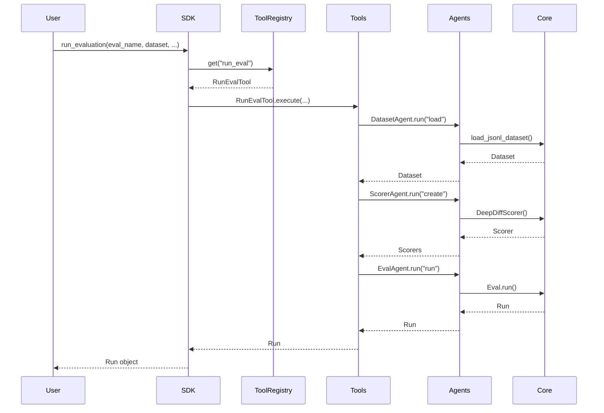

# SDK Flow: Programmatic Interface

This document explains how the SDK (programmatic interface) flows through the architecture: **SDK → Tools → Agents → Core Components**.

**Related Documents:**
- [CLI Flow](./cli-flow.md) - Command-line interface flow
- [Conversational Flow](./conversational-flow.md) - Natural language interface flow
- [Architecture Document](./conversational-agent-architecture.plan.md) - Overall architecture

---

## Architecture Overview

```
User Calls SDK Function
    ↓
SDK Function (Convenience Wrapper OR Direct Tool Call)
    ↓
Tool Registry (Finds Tool)
    ↓
Tool.execute() (Wraps Agent Operations)
    ↓
Agent.run() (Orchestrates)
    ↓
Core Components (Eval, Dataset, Scorers, Adapters)
    ↓
Results Returned as Objects
```

**Key Principle:** SDK uses the same tools foundation as CLI. Users can call tools directly or use convenience functions. No LLM required.

---

## Two Usage Patterns

### Pattern 1: Direct Tool Calls (More Control)

Users can call tools directly for maximum control:

```python
from aieval.agents.tools.registry import get_tool_registry

# Get tool registry
tool_registry = get_tool_registry()

# Get individual tools
load_dataset_tool = tool_registry.get("load_dataset")
create_scorer_tool = tool_registry.get("create_scorer")
create_eval_tool = tool_registry.get("create_eval")
run_eval_tool = tool_registry.get("run_eval")

# Use tools programmatically
import asyncio

async def run_my_evaluation():
    # 1. Load dataset
    dataset = await load_dataset_tool.execute(
        dataset_type="jsonl",
        path="benchmarks/datasets/my_dataset.jsonl"
    )
    
    # 2. Create scorer
    scorer = await create_scorer_tool.execute(
        scorer_type="deep_diff",
        name="deep_diff",
        version="v3"
    )
    
    # 3. Create eval
    eval_ = await create_eval_tool.execute(
        name="my_eval",
        dataset=dataset,
        scorers=[scorer]
    )
    
    # 4. Run eval
    run = await run_eval_tool.execute(
        eval_=eval_,
        adapter_config={
            "type": "http",
            "base_url": "https://api.example.com"
        },
        model="claude-3-5-sonnet-20241022"
    )
    
    return run

# Execute
result = asyncio.run(run_my_evaluation())
print(f"Run ID: {result.run_id}")
print(f"Scores: {len(result.scores)}")
```

### Pattern 2: Convenience Functions (Easier Usage)

The SDK provides convenience functions that wrap tools:

```python
from aieval import run_evaluation, load_dataset, create_scorer

# High-level SDK functions (internally use tools)
async def run_my_evaluation():
    # 1. Load dataset (uses LoadDatasetTool internally)
    dataset = await load_dataset(
        dataset_type="jsonl",
        path="benchmarks/datasets/my_dataset.jsonl"
    )
    
    # 2. Create scorer (uses CreateScorerTool internally)
    scorer = await create_scorer(
        scorer_type="deep_diff",
        name="deep_diff",
        version="v3"
    )
    
    # 3. Run evaluation (uses RunEvalTool internally)
    run = await run_evaluation(
        eval_name="my_eval",
        dataset=dataset,
        scorers=[scorer],
        adapter_config={
            "type": "http",
            "base_url": "https://api.example.com"
        },
        model="claude-3-5-sonnet-20241022"
    )
    
    return run

# Execute
result = asyncio.run(run_my_evaluation())
```

---

## SDK Implementation (Convenience Functions)

```python
# src/aieval/sdk/__init__.py
from aieval.agents.tools.registry import get_tool_registry

async def load_dataset(dataset_type: str, path: str, **kwargs) -> list[DatasetItem]:
    """Load a dataset (convenience function)."""
    tool_registry = get_tool_registry()
    tool = tool_registry.get("load_dataset")
    return await tool.execute(dataset_type=dataset_type, path=path, **kwargs)

async def create_scorer(scorer_type: str, **kwargs) -> Scorer:
    """Create a scorer (convenience function)."""
    tool_registry = get_tool_registry()
    tool = tool_registry.get("create_scorer")
    return await tool.execute(scorer_type=scorer_type, **kwargs)

async def run_evaluation(
    eval_name: str,
    dataset: list[DatasetItem] | str,  # Can pass dataset or path
    scorers: list[Scorer] | list[dict],  # Can pass scorers or configs
    adapter_config: dict,
    **kwargs
) -> Run:
    """Run an evaluation (convenience function)."""
    tool_registry = get_tool_registry()
    run_eval_tool = tool_registry.get("run_eval")
    
    # Handle convenience: if dataset is string, load it
    if isinstance(dataset, str):
        load_tool = tool_registry.get("load_dataset")
        dataset = await load_tool.execute(
            dataset_type="jsonl" if dataset.endswith(".jsonl") else "index_csv",
            path=dataset
        )
    
    # Handle convenience: if scorers are dicts, create them
    if scorers and isinstance(scorers[0], dict):
        create_scorer_tool = tool_registry.get("create_scorer")
        created_scorers = []
        for scorer_config in scorers:
            scorer = await create_scorer_tool.execute(**scorer_config)
            created_scorers.append(scorer)
        scorers = created_scorers
    
    # Use RunEvalTool
    return await run_eval_tool.execute(
        eval_name=eval_name,
        dataset=dataset,
        scorers=scorers,
        adapter_config=adapter_config,
        **kwargs
    )
```

**Key Point:** Convenience functions handle common cases (string paths, dict configs) but internally use the same tools.

---

## Using Skills in SDK

Skills can also be used programmatically:

```python
from aieval.agents.skills.registry import get_skill_registry

async def run_evaluation_with_skill():
    skill_registry = get_skill_registry()
    evaluation_skill = skill_registry.get("evaluation")
    
    # Use skill for complete workflow
    run = await evaluation_skill.execute(
        eval_name="my_eval",
        dataset_path="benchmarks/datasets/my_dataset.jsonl",
        scorer_types=["deep_diff", "llm_judge"],
        adapter_config={
            "type": "http",
            "base_url": "https://api.example.com"
        },
        model="claude-3-5-sonnet-20241022"
    )
    
    return run

result = asyncio.run(run_evaluation_with_skill())
```

---

## SDK Flow Diagram



---

## SDK vs CLI Comparison

| Aspect | CLI | SDK |
|--------|-----|-----|
| **Interface** | Command-line arguments | Python functions |
| **Tool Usage** | Direct tool calls | Direct tool calls OR convenience functions |
| **Output** | Printed to stdout | Returned as objects |
| **Error Handling** | Exceptions → exit codes | Exceptions → raise errors |
| **Async** | `asyncio.run()` wrapper | Native async/await |
| **Example** | `aieval run --config config.yml` | `run_evaluation(...)` |

---

## SDK Benefits

1. **Programmatic Control**: Full Python control flow (loops, conditionals, error handling)
2. **Composability**: Combine multiple operations easily
3. **Testing**: Easy to test SDK code
4. **Integration**: Easy to integrate into larger applications
5. **Same Foundation**: Uses same tools as CLI (consistent behavior)

---

## Complete Example: Multi-Model Evaluation

```python
# User's application code
import asyncio
from aieval import run_evaluation
from aieval.agents.tools.registry import get_tool_registry

async def evaluate_multiple_models():
    """Evaluate multiple models and compare results."""
    tool_registry = get_tool_registry()
    compare_tool = tool_registry.get("compare_runs")
    
    models = ["claude-3-5-sonnet", "gpt-4o", "claude-3-opus"]
    runs = []
    
    # Run evaluation for each model
    for model in models:
        run = await run_evaluation(
            eval_name="my_eval",
            dataset="benchmarks/datasets/my_dataset.jsonl",
            scorers=[{"type": "deep_diff", "version": "v3"}],
            adapter_config={"type": "http", "base_url": "https://api.example.com"},
            model=model
        )
        runs.append(run)
        print(f"Completed {model}: {run.run_id}")
    
    # Compare all runs
    if len(runs) >= 2:
        comparison = await compare_tool.execute(
            run1=runs[0],
            run2=runs[1]
        )
        print(f"Improvements: {comparison.improvements}")
        print(f"Regressions: {comparison.regressions}")
    
    return runs

# Execute
results = asyncio.run(evaluate_multiple_models())
```

---

## Summary

1. **SDK** → Provides Python functions that call tools (no LLM)
2. **Tools** → Wrap agent operations, provide clean interface
3. **Agents** → Orchestrate domain logic (dataset, scorer, eval, adapter)
4. **Core Components** → Do actual work (load data, score, generate output)
5. **Skills** → Optional workflows that compose multiple tools

**Key Principles:**
- SDK uses same tools foundation as CLI (consistent behavior)
- Two usage patterns: Direct tool calls (control) or convenience functions (simplicity)
- No LLM required (fast, predictable)
- Full Python control flow (loops, conditionals, error handling)
- Easy to test and integrate
